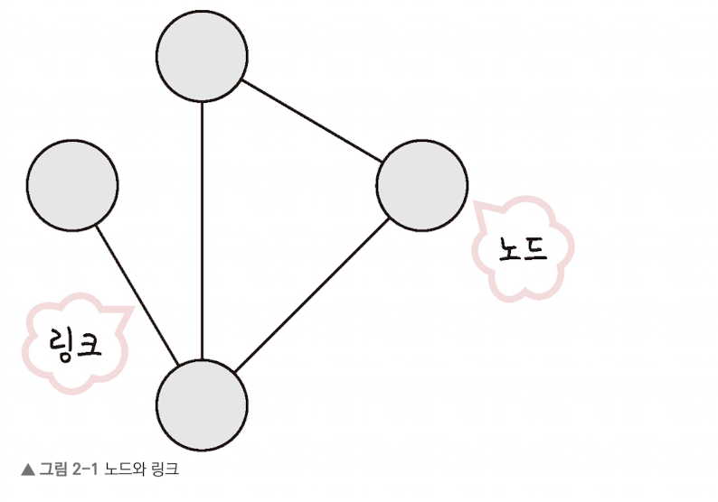

# 면접을 위한 CS 전공 지식 노트 - 2.네트워크

태그: BOOK
생성 일시: 2023년 11월 25일 오전 6:29

# 2. 네트워크

## 2.1 네트워크 기초

### 네트워크

- 장치들이 통신 기술을 이용하는 구축하는 연결망의 의미함
- node와 Link가 서로 연결되어 있거나 연결되어 있으며 리소스를 공유하는 집합을 의미함
    - node : server, router, switch 등 네트워크 장비를 의미함
        
        
        

### 2.1.1 처리량과 지연 시간

- 좋은 네트워크 : 많은 처리량을 처리할 수 있으며 지연 시간이 짧고 장애 빈도가 적고 안전한 보안성을 가진 네트워크

**처리량(throughput)**

- 링크 내에서 성공적으로 전달된 데이터의 양의 말함  = 얼만큼의 트랙픽 처리
- 처리량이 충분하다 = 많은 트랙픽을 감당할 수 있다.
- 단위로는 bps(bit per second)를 사용함 :  초당 수신되는 비트의 수
- 트래픽 : 링크 내 흐르는 데이터의 양 _ 서버에 저장된 파일을 클라이언트에서 다운로드할 때 발생되는 데이터의 누적량

대역폭 : 주어진 시간 동안 네트워크 연결을 통해 흐를 수 있는 최대 비트 수를 의미함 

**지연시간(latency)**

- 요청이 처리되는 시간을 말함 → 메세지가 두 장치 사이를 왕복하는데 걸리는 시간을 의미
- 지연 시간은 매체 타입, 패킷 크기, 라우터의 패킷 처리 시간에 영향을 받음

### 2.1.2 네트워크 병목 현상 : 토폴로지

**네트워크 토폴로지**

- 노드와 링크가 어떻게 배치되어 있는지에 대한 방식이자 연결 형태를 의미함

트리 토폴로지 

- 계층형 토폴로지라고 하며 트리 형태로 배치한 네트워크 구성을 의미
- 노드 추가 삭제가 쉬우며 트래픽이 집중될 때 하위 노드에 영향을 끼칠 수 있음

버스 토폴로지 

- 중앙 통신 회선 하나에 여러 개의 노드가 연결되어 공유하는 네트워크 구성을 의미함 LAN에서 많이 사용된다
- 설치 비용이 적고 신뢰성이 우수함 _ 스푸핑에 대한 위험이 존재한다
    - 스푸핑 : LAN 상에서 송신부의 패킷을 송신과 상관없는 다른 호스트에게 가지 않도록 스위칭하는 기능을 마비시키거나 속여서 특정 노드에 해당 패킷이 오도록 처리하는 것을 의미함

스타 토폴로지 

- 중앙에 있는 노드에 모두가 연결되어있는 구성을 의미함
- 노드 추가 및 에러 탐지 용이, 노드끼리의 간섭이 없음 다만 중앙에 오류가 발생하면 전부 마비되고 설치비용이 비싸다는 단점이 존재함

링형 토폴로지 

- 각각의 노드가 양 옆의 두 노드와 연결하여 전체적으로 고리처럼 하나의 연속된 길을 통해 통신하는 구조를 의미함
- 네트워크 구성 변경이 어렵다는 단점이 존재하며 회선에 장애라도 발생하면 네트워크 전체에 큰 영향이 있음

메시 토폴로지 

- 망형 토폴리지
- 한 단말에 장애가 발생하더라고 여러 개의 경로가 존재함으로 네트워크 지속적으로 사용할 수 있고, 트래픽 분산 처리도 가능하다. 노드 구축이 어려움 운용비용이 고가임

**병목 현상**

- 토폴로지가 중요한 이유는 병목 현상을 찾을 때의 기준이 되기 때문임
- 병목이 발생하면 어떤 구조의 토폴로지로 구성되어있는지 확인 후 회선을 추가하여 병목 현상을 해결 할 수 있음

 

### 2.1.3 네트워크 분류

- 규모에 따른 분류  WAN, MAN, LAN

LAN : 근거리 통신에서 사용됨 = 속도 빠름 

MAN : 대도시 지연 네트워크 도시와 같은 넓은 지역 운영에 사용된다. = 속도 중간 

WAN : 국가 혹은 대륙 같은 더 넓은 지역 운영에 사용된다  = 속도 느림 

### 2.1.4 네트워크 성능 분석 명령어

- 주된 병목 원인
    - 네트워크 대역폭
    - 네트워크 토폴로지
    - 서버, CPU, 메모리 사용량
    - 비효율적 네트워크 구성 등
- Ping
    - TCP/IP의  프로토콜인 ICMP 프로토콜을 활용해 동작함
- netstat
    - 접속되어 있는 서비스들의 네트워크 상태를 표시하는데 사용되며 접속, 라우팅 테이블, 네트워크 프로토콜 등 리스트를 보여줌 = 주로 서비스 포트가 열려있는지 확인할 때 사용함
    - 현재 접속하고 있는 사이트 등에 대한 상태 리스트 확인 가능
- nslookup
    - DNS 에 관련된 내용을 확인하기 위해 쓰는 명령어 _ 특정 도메인에 매핑된 IP를 확인하기 위해 사용한다.
    - nslookup
        - [google.com](http://google.com)
        - naver.com
        - 등 사용 가능
- tracert
    - 윈도우 tracert , 리눅스 traceroute
    - 목적지 노드까지의 네트워크 경로를 확인할 때 사용할 때 사용하는 명령어
    - 어떤 구간에서 명목이 걸리는지 확인할 수 있음

### 2.1.5 네트워크 프로토콜 표준화

- 다른 장치까지 데이터를 주고 받기 위해 설정된 공통된 인터페이스를 말함

## 2.2 TCP/IP 4 계층 모델

### 2.2.1 계층 구조

- OSI 7 계층  TCP/IP 4계층
    - 네트워크 통신 프로토콜의 집합

- 어플리케이션 계층
    - appliction : FTP, HTTP, SSH, SMTP, DNS 등 응용 프로그램이 존재함
    - 웹 서비스, 이메일 등 사용자에게 제공하는 계층을 의미함
    - SMTP : 전자 메일을 위한 프로토콜
- 전송 계층
    - 송신자와 수신자를 연결하는 통신 서비스를 제공하는 계층
    - 연결 지향 데이터 스트림, 신뢰성 , 흐름 제어 등을 제공함
    - TCP. UDP가 여기에 해당함
    
    **TCP**
    
    패킷 사이의 순서를 보장하고 연결 지향 프로토콜을 사용해서 연결하여 신뢰성 구축 수신 여부 확인 “가상회선 패킷 교환 방식”을 이용함
    
    - 각 패킷에 가상회선 식별자가 포함되어 모든 패킷을 전공하면 가상회선이 해체되고 순서대로 도착을 보장함
    
    
    
    연결 성립 과정 (3way-handshake)
    
    - SYN : isn  임의의 시퀀스 추가해서 보냄
    - SYN + ACK : 서버의 isn과 클라이언트의 isn에 + 1해서보냄
    - ACK :클라이언트는 서버의 ISN +1 한값을 보냄
    
    
    
    연결 해제 과정 
    
    - Time_Wait가 존재하는 이유는 : 지연 패킷이 발생했을 경우 대비를 하기 위해
    - 무결성 보장을 위해 존재한다.
    
    
    
    **UDP**
    
    순서를 보장하지 않고 수신 여부를 확인하지 않으며 단순히 데이터만 주고 받는 “데이터그램 패킷 교환 방식”을 이용함 
    
    - 패킷이 독립적으로 이동하며 최적의 경로를 선택해 나감, 서로 다른 경로로 도착할 수 있으며 순서가 다를 수 있는 방식을 의미함
    
    
    
- 인터넷 계층
    - 패킷을 ip 주소로 지정된 목적지로 전송하기 위해 사용되는 계층
    - ip,arp,icmp등이 있으며 수신해야할 상대의 주소를 지정하여 데이터 전달
    - 상대방에 제대로 받았는지 보장하지 않는 비연결형적인 특징을 가지고 있음
- 링크 계층
    - 전선, 광섬유, 무선 등으로 실질적으로 데이터를 전달하면 장치 간 신호를 주고받는 규칙을 정하는 계층